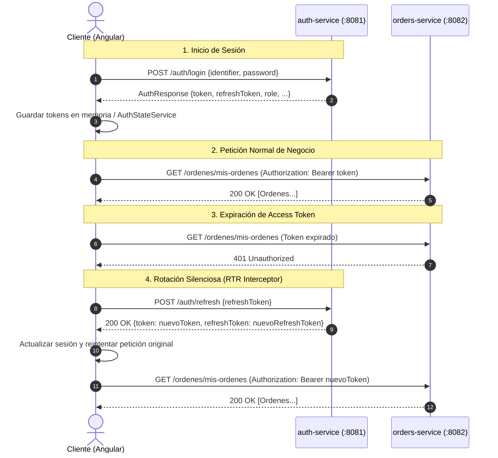

# Guía de Integración Frontend y Especificación de Arquitectura Backend
**Sistema de Pollería — Fase 1 & Hardening de Seguridad**  
**Stack Frontend:** Angular 19 (Signals, Standalone Components, Functional Interceptors, RxJS 7.8)  
**Stack Backend:** Spring Boot 3.4.3 (Java 21), Spring Security 6, Spring Data JPA, PostgreSQL (AWS RDS)

---

## 1. Mapa de Servicios y Endpoints Base

| Microservicio | URL Base (Local) | Puerto | Responsabilidad Primaria |
| :--- | :--- | :---: | :--- |
| **`auth-service`** | `http://localhost:8081` | 8081 | Identidad, Registro, Login, 2FA, Emisión/Rotación de JWT y Sesiones. |
| **`orders-service`** | `http://localhost:8082` | 8082 | Gestión de Carta, Mesas, Pedidos (Órdenes) y Estados de Cocina/Salón. |
| **`payments-service`** | `http://localhost:8083` | 8083 | Transacciones, Métodos de Pago, Preferencias y Webhook de Mercado Pago. |
| **`notification-service`** | `http://localhost:3001` | 3001 | Notificaciones en tiempo real vía WhatsApp (Node.js/Express). |

---

## 2. Modelos y Contratos TypeScript (DTOs del Frontend)

```typescript
// ==========================================
// 1. AUTENTICACIÓN Y USUARIO (auth-service)
// ==========================================

export type Role = 'CLIENTE' | 'MOZO' | 'COCINA' | 'ADMIN' | 'REPARTIDOR';

export interface User {
  id?: number;
  name: string;
  email: string;
  phone?: string;
  role: Role;
}

export interface RegisterRequest {
  name: string;
  email: string;
  phone?: string;
  password: string; // Min 6 chars, debe contener letras y números
  role: Role;
}

export interface LoginRequest {
  identifier: string; // Email o Teléfono móvil
  password: string;
}

export interface Verify2FaRequest {
  email: string;
  code: string; // Código de 6 dígitos enviado por correo
}

export interface RefreshTokenRequest {
  refreshToken: string; // UUID v4 del refresh token persistido
}

export interface LogoutRequest {
  refreshToken: string;
}

export interface AuthResponse {
  token: string | null;            // Access Token JWT (HS256)
  refreshToken: string | null;     // Refresh Token UUID
  tokenType: string | null;        // "Bearer"
  expiresIn: number | null;        // Duración en segundos (ej. 86400)
  name: string | null;
  email: string | null;
  role: Role | null;
  requiresTwoFactor: boolean;      // true para ADMIN/MOZO/COCINA/REPARTIDOR en login inicial
  message: string;
}

export interface TokenValidationResponse {
  valid: boolean;
  email?: string;
  role?: Role;
  message?: string;
}

// ==========================================
// 2. PRODUCTOS Y MESAS (orders-service)
// ==========================================

export type CategoriaProducto =
  | 'POLLO_ENTERO'
  | 'MEDIO_POLLO'
  | 'CUARTO_POLLO'
  | 'COMBO'
  | 'PARRILLA'
  | 'GUARNICION'
  | 'BEBIDA'
  | 'POSTRE'
  | 'PROMOCION';

export interface Producto {
  id: number;
  nombre: string;
  descripcion: string;
  precio: number;
  categoria: CategoriaProducto;
  disponible: boolean;
  imagenUrl?: string;
  creadoEn?: string;
  actualizadoEn?: string;
}

export type EstadoMesa = 'LIBRE' | 'OCUPADA' | 'RESERVADA';

export interface Mesa {
  id: number;
  numero: number;
  capacidad: number;
  estado: EstadoMesa;
  qrCode?: string;
}

// ==========================================
// 3. ÓRDENES Y DETALLES (orders-service)
// ==========================================

export type TipoOrden = 'SALON' | 'DELIVERY' | 'RECOJO';

export type EstadoOrden =
  | 'RECIBIDO'
  | 'EN_PREPARACION'
  | 'LISTO'
  | 'EN_CAMINO'
  | 'ENTREGADO'
  | 'CANCELADO';

export interface OrdenItemRequest {
  productoId: number;
  cantidad: number;
  notas?: string;
}

export interface CrearOrdenRequest {
  tipo: TipoOrden;
  mesaId?: number | null;          // Obligatorio para SALON
  direccionEntrega?: string;       // Obligatorio para DELIVERY
  referencia?: string;
  nombreCliente?: string;          // Opcional / Chatbot / Delivery
  telefonoCliente?: string;
  observaciones?: string;
  items: OrdenItemRequest[];       // Mínimo 1 producto (el backend calcula precio unitario)
}

export interface ItemResponse {
  productoId: number;
  productoNombre: string;
  cantidad: number;
  precioUnitario: number;
  subtotal: number;
  notas?: string;
}

export interface OrdenResponse {
  id: number;
  tipo: TipoOrden;
  estado: EstadoOrden;
  clienteId?: number;
  mozoId?: number;
  repartidorId?: number;
  mesaNumero?: number;
  direccionEntrega?: string;
  referencia?: string;
  nombreCliente?: string;
  telefonoCliente?: string;
  total: number;
  observaciones?: string;
  creadoEn: string;
  actualizadoEn: string;
  items: ItemResponse[];
}

// ==========================================
// 4. PAGOS (payments-service)
// ==========================================

export type MetodoPago = 'CONTRAENTREGA' | 'TARJETA' | 'YAPE_PLIN';
export type EstadoPago = 'PENDIENTE' | 'APROBADO' | 'RECHAZADO' | 'CANCELADO';

export interface IniciarPagoRequest {
  ordenId: number;
  monto: number;
  metodoPago: MetodoPago;
  tokenPasarela?: string;          // Para TARJETA (token pasarela / Culqi / etc.)
  telefonoYape?: string;           // Para YAPE_PLIN (número celular)
}

export interface PagoResponse {
  id: number;
  ordenId: number;
  clienteId: number;
  monto: number;
  metodoPago: MetodoPago;
  estado: EstadoPago;
  referenciaExterna?: string;
  detalle?: string;
  creadoEn: string;
  actualizadoEn: string;
}

export interface MercadoPagoPreferenceResponse {
  preferenceId: string;
  initPoint: string;
  sandboxInitPoint: string;
}
```

---

## 3. Arquitectura del Flujo de Autenticación y Refresh Token Rotation

### 3.1. Flujo de Estados en el Cliente



### 3.2. Regla Crítica: Prevención de Múltiples Refresh Concurrentes (Mutex Pattern)
Dado que el backend implementa **Detección Automática de Reuso**, si 5 peticiones HTTP fallan con `401` al mismo tiempo en la UI (por ejemplo al cargar el dashboard), el interceptor del frontend **NO DEBE** disparar 5 llamadas a `POST /auth/refresh`. Si lo hiciera, la primera tendría éxito y las otras 4 intentarían usar un token ya revocado, disparando la alarma de compromiso de cuenta y revocando toda la sesión del usuario legítimo.

Para resolver esto en Angular 19 con RxJS se implementa el **patrón Mutex con `BehaviorSubject`**:

```typescript
// auth.interceptor.ts
import { inject } from '@angular/core';
import { HttpInterceptorFn, HttpRequest, HttpHandlerFn, HttpErrorResponse } from '@angular/common/http';
import { BehaviorSubject, throwError, Observable } from 'rxjs';
import { catchError, filter, switchMap, take } from 'rxjs/operators';
import { AuthService } from '../services/auth.service';

let isRefreshing = false;
const refreshTokenSubject = new BehaviorSubject<string | null>(null);

export const authInterceptor: HttpInterceptorFn = (req: HttpRequest<unknown>, next: HttpHandlerFn) => {
  const authService = inject(AuthService);
  const token = authService.getAccessToken();

  let authReq = req;
  // Solo adjuntar si existe token y no es petición hacia auth público
  if (token && !req.url.includes('/auth/login') && !req.url.includes('/auth/refresh') && !req.url.includes('/auth/register')) {
    authReq = req.clone({
      setHeaders: { Authorization: `Bearer ${token}` }
    });
  }

  return next(authReq).pipe(
    catchError((error: HttpErrorResponse) => {
      // Interceptar 401 si no estamos ya autenticando o renovando
      if (error.status === 401 && !req.url.includes('/auth/login') && !req.url.includes('/auth/refresh')) {
        return handle401Error(authReq, next, authService);
      }
      return throwError(() => error);
    })
  );
};

function handle401Error(req: HttpRequest<unknown>, next: HttpHandlerFn, authService: AuthService): Observable<any> {
  if (!isRefreshing) {
    isRefreshing = true;
    refreshTokenSubject.next(null);

    const refreshToken = authService.getRefreshToken();
    if (!refreshToken) {
      isRefreshing = false;
      authService.forceLogout();
      return throwError(() => new Error('No refresh token available'));
    }

    return authService.refreshTokens(refreshToken).pipe(
      switchMap((response) => {
        isRefreshing = false;
        authService.saveSession(response);
        refreshTokenSubject.next(response.token);
        // Reintentar la petición que originalmente falló
        return next(req.clone({
          setHeaders: { Authorization: `Bearer ${response.token}` }
        }));
      }),
      catchError((refreshErr) => {
        isRefreshing = false;
        // Si el refresh falla (expirado o reuso detectado), forzar logout inmediato
        authService.forceLogout();
        return throwError(() => refreshErr);
      })
    );
  } else {
    // Si ya hay un refresh en curso, las otras peticiones esperan en cola a que se emita el nuevo token
    return refreshTokenSubject.pipe(
      filter(token => token !== null),
      take(1),
      switchMap(token => {
        return next(req.clone({
          setHeaders: { Authorization: `Bearer ${token}` }
        }));
      })
    );
  }
}
```

---

## 4. Guards de Rutas y RBAC en Angular 19

### Matriz de Roles y Autorizaciones de Vistas
| Rol | Rutas Autorizadas | Acciones Permitidas |
| :--- | :--- | :--- |
| **`CLIENTE`** | `/carta`, `/mis-pedidos`, `/pago/:id`, `/perfil` | Ver carta, pedir, ver historial propio, pagar. |
| **`MOZO`** | `/salon`, `/mesas`, `/pedidos/activos`, `/cobros` | Asignar mesas, tomar pedidos, marcar órdenes como atendidas. |
| **`COCINA`** | `/cocina/kds`, `/cocina/ordenes` | Visualizar comandas, cambiar estado a `EN_PREPARACION` y `LISTO`. |
| **`REPARTIDOR`**| `/delivery/hoja-ruta`, `/delivery/:id` | Ver pedidos en camino, confirmar contraentrega. |
| **`ADMIN`** | `/*` (Acceso Total a Backoffice y Métricas) | Configurar productos, precios, ver auditorías y reportes. |

### Implementación Functional Guard (`role.guard.ts`)
```typescript
import { inject } from '@angular/core';
import { CanActivateFn, Router } from '@angular/router';
import { AuthService } from '../services/auth.service';
import { Role } from '../models/auth.models';

export const roleGuard = (allowedRoles: Role[]): CanActivateFn => {
  return (route, state) => {
    const authService = inject(AuthService);
    const router = inject(Router);

    const currentUser = authService.currentUser();
    if (!currentUser) {
      router.navigate(['/login'], { queryParams: { returnUrl: state.url } });
      return false;
    }

    if (allowedRoles.includes(currentUser.role)) {
      return true;
    }

    router.navigate(['/acceso-denegado']);
    return false;
  };
};
```

---

## 5. Arquitectura Backend y Hardening para Futuras Revisiones de Código

Para auditorías o code reviews del backend, los siguientes invariantes arquitectónicos deben mantenerse:

### 5.1. Invariantes de Seguridad y Manejo de Tokens
1. **Separación de Responsabilidad de Sesiones:**
   - La tabla `refresh_tokens` vive **únicamente** en la base de datos de `auth-service`.
   - `orders-service` y `payments-service` son **estrictamente stateless**: no mantienen sesiones ni consultan a base de datos para verificar tokens; solo validan criptográficamente el JWT con la clave secreta compartida en `JwtAuthFilter.java`.
2. **Refresh Token Rotation (RTR):**
   - Todo Refresh Token debe ser de un solo uso.
   - En `RefreshTokenService.java`, la rotación marca el token anterior como `revoked = true` y registra `replacedByToken`.
3. **Detección Automática de Reuso (Revocación en Cadena):**
   - Si se recibe un token con `revoked == true`, se invoca inmediatamente `revokeAllUserTokens(user)`. No debe modificarse esta política a menos que se implemente un mecanismo distribuido alternativo (e.g. Redis Session Blocklist).
4. **Headers HTTP Defensivos:**
   - Todo `SecurityConfig` en Spring Boot debe mantener:
     - `X-Frame-Options: DENY`
     - `X-Content-Type-Options: nosniff`

### 5.2. Invariantes de Control de Acceso (RBAC)
- No delegar validaciones de roles de endpoints mutables únicamente a filtros HTTP; utilizar anotaciones explícitas `@PreAuthorize("hasRole('ADMIN')")` o `@PreAuthorize("hasAnyRole('ADMIN', 'MOZO', 'COCINA')")` directamente en los métodos de los controladores.
- La entidad `User` debe mantener su rol normalizado con el prefijo `ROLE_` en la autoridad de Spring Security (`SimpleGrantedAuthority("ROLE_" + user.getRole().name())`).

---

## 6. Checklist de Implementación para el Desarrollador Frontend

- [ ] Configurar interceptor HTTP con patrón de cola/mutex para evitar colisiones de refresh.
- [ ] Guardar `token` y `refreshToken` en almacenamiento seguro (o memoria reactiva en `AuthService`).
- [ ] Configurar `roleGuard` en el árbol de rutas de `app.routes.ts`.
- [ ] Implementar interceptor de errores globales para capturar errores de validación (`400 Bad Request`) con los mensajes descriptivos del backend.
- [ ] En pantallas de formulario (ej. Registro), validar localmente la regla de contraseña: mínimo 6 caracteres, alfanumérico (al menos 1 letra y 1 número).
